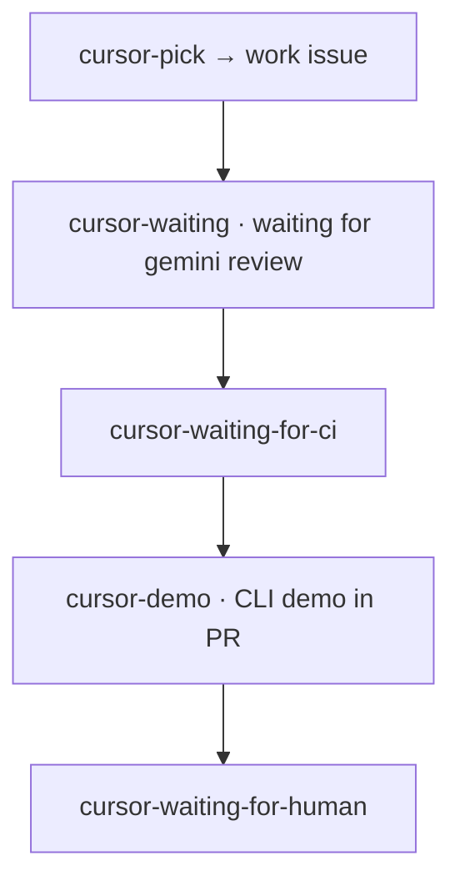

# Issue Workflow

This is a github label based simple workflow for having cursor work on issues and PRs.

## Labels

- `cursor-pick`: Assigns the issue to cursor. (Only issues)
- `cursor-pr-open`: Indicates that cursor has opened a PR (Only issues)
- `cursor-ignore`: Cursor will not work on this issue or PR.

- `cursor-waiting`: Cursor is done with the first pass, and is waiting 1h for gemini to review. If the PR has no comments yet, automation posts `@gemini review this PR` once, then waits. (Only PRs)
- `cursor-waiting-for-ci`: Automation is waiting for GitHub Actions on the PR; failures and **cancelled** runs get a `@cursor` prompt with details (still this label until CI is green). (Only PRs)
- `cursor-demo`: CI is green; automation posts a `@cursor` prompt to refresh **CLI demo notes** in the PR description (commands + sample terminal output), then hands off. (Only PRs)
- `cursor-waiting-for-human`: Cursor automation is done; a human should review the PR. (Only PRs)

## Mermaid Diagram

_Happy path only._ Retries (CI failures, cancelled runs, fix loops, `cursor-ignore`, and so on) are described in the label list above.
