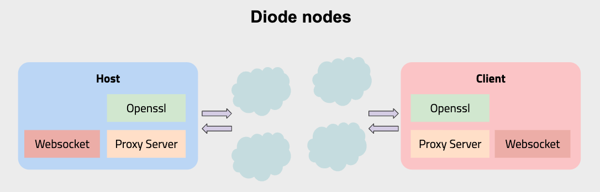

# Diode Client

[](https://travis-ci.com/diodechain/diode_client)

[](https://goreportcard.com/report/github.com/diodechain/diode_client)

`diode` is the Go CLI for connecting a device or service to the Diode mesh network. It can:

- publish local TCP/TLS/UDP ports to remote Diode clients
- run a local SOCKS5 proxy for reaching `.diode` services
- expose files over the network and transfer them with `push` / `pull`
- resolve BNS names and query network/device information
- run contract-driven perimeter configuration with `join`
- act as an MCP server for AI tooling over stdio

All traffic is routed through the Diode network and secured with Diode's client identity and end-to-end encrypted sessions.



## What This README Covers

- how to build and run the client
- what gets created on first run
- the commands you are most likely to use
- how to publish ports, browse Diode services, transfer files, use SSH, and run MCP
- where config lives, how the config API works, and the common pitfalls
- how shared CLI/API/join controls are wired for maintainers

## Requirements

- Go `1.22.x` or newer enough to build the module as checked in
- CGO enabled for normal builds
- OpenSSL build support available locally

Optional:

- WireGuard installed if you plan to use `diode join -wireguard`
- GTK/AppIndicator libraries if you want tray support on Linux
- OpenSSH client tools if you plan to use `diode ssh`

## Install a Released Binary

If you want the packaged CLI instead of building from source, the published CLI docs point to:

- Downloads: <https://diode.io/download>
- Install script: `curl -Ssf https://diode.io/install.sh | sh`

## Build

```bash
go mod download
make openssl
make
```

This builds the main binary as `./diode`.

If you only want to run it during development:

```bash
go run ./cmd/diode --help
```

## First Run

The client stores local state in a small file database. By default that database is created at:

- Linux: `~/.config/diode/private.db`
- macOS: `~/Library/Application Support/diode/private.db`
- Windows: `C:\Users\<yourname>\AppData\Roaming\diode\private.db`

On first start the client automatically creates a secp256k1 private key and derives your Diode client address from it. You can inspect what is stored locally with:

```bash
./diode -update=false config -list
```

Important stored values:

- `private`: your client private key
- `fleet`: the fleet/perimeter address this client uses

If `fleet` has not been configured yet, the client uses the default development fleet until you either:

- run `diode reset` to create a new fleet contract for this client, or
- set an existing fleet manually with `diode config -set fleet=0x...`

## Quick Start

### 1. Check your identity

```bash
./diode -update=false config -list
```

### 2. Publish a local web server

If your app listens on `localhost:8080` and you want it exposed on public Diode port `80`:

```bash
./diode publish -public 8080:80
```

If the publish succeeds, the client logs the public gateway URL:

- `http://<name-or-address>.diode.link/` for public port `80`
- `https://<name-or-address>.diode.link:<port>/` for some public high ports such as `8000-8100`

### 3. Browse Diode services through a local SOCKS proxy

```bash
./diode socksd
```

This starts a SOCKS5 proxy on `127.0.0.1:1080`. Point your browser or app at that proxy to reach `.diode` names directly.

### 4. Fetch a Diode URL from the command line

```bash
./diode fetch -url http://mydevice.diode
./diode fetch -url https://mydevice.diode.link:8080/file.txt -output file.txt
```

## Command Overview

Top-level commands:

- `publish`: publish local services to the network
- `socksd`: run a local SOCKS5 proxy
- `fetch`: issue HTTP requests to Diode endpoints
- `files`: run a published HTTP file listener
- `push` / `pull`: upload or download files from a Diode file listener
- `ssh`: connect to a Diode target through an auto-managed local SOCKS proxy
- `scp`: copy files to/from a Diode target through an auto-managed local SOCKS proxy
- `join`: apply on-chain perimeter properties and optional WireGuard config
- `bns`: register, transfer, and resolve BNS names
- `query`: resolve a Diode address or name and print device tickets
- `token`: check balance or transfer DIODE
- `config`: inspect or change local stored values
- `mcp`: run the client as an MCP server over stdin/stdout
- `gateway`: run a public HTTP/HTTPS gateway
- `time`: query consensus time
- `version`: print build version

One implementation detail that is easy to miss: if you run `diode` with no subcommand, the CLI falls back to `publish`. Use explicit subcommands in scripts and docs.

Another important parser rule: global options must come before the subcommand.

```bash
./diode -debug=true publish -public 80:80
```

Not:

```bash
./diode publish -debug=true -public 80:80
```

If you plan to contribute code, see [CONTRIBUTING.md](CONTRIBUTING.md).

## Publishing Ports

`publish` is the core command for exposing a local service.

```bash
./diode publish -public 8080:80
./diode publish -protected 3000:3000
./diode publish -private 22:22,0xabc...,myfriend
```

Port mapping forms:

- `<local_port>`: publish the same local and remote port
- `<local_port>:<remote_port>`: publish local to a different external port
- `<host>:<local_port>:<remote_port>`: bind to a specific local host
- append `:tcp`, `:tls`, or `:udp` to force a protocol

Examples:

```bash
./diode publish -public 8080
./diode publish -public 127.0.0.1:8080:80:tcp
./diode publish -public 80:80,2368:8025
./diode publish -private 22:22:tcp,0x1111111111111111111111111111111111111111
./diode publish -protected 3000:3000
```

Publish modes:

- `-public`: anybody can connect
- `-private`: you must provide at least one allowlisted address or BNS name
- `-protected`: intended for fleet/perimeter-controlled access

Useful flags:

- `-socksd`: start a SOCKS proxy alongside the publisher
- `-proxy_host` / `-proxy_port`: configure that proxy
- `-sshd`: publish the embedded Diode SSH service
- `-files`: add one or more file listeners to the same long-running publisher
- `-fileroot`: root path for all `-files` listeners on that command

The simplest static-site workflow from the public docs is:

```bash
mkdir project
cd project
echo "Hello World" > index.html
../diode publish -http
```

That starts the built-in static server and publishes it through Diode.

If you run `publish` without any ports, files listeners, or binds, the client exits with an error.

## Files, Push, and Pull

The client includes a simple HTTP file listener and matching upload/download commands.

Start a public file listener on Diode port `8080`:

```bash
./diode files 8080
```

Serve files relative to a specific directory:

```bash
./diode files -fileroot /var/inbox 8080
```

Private file listener:

```bash
./diode files -fileroot /var/inbox 8080,mydevice,0x0000000000000000000000000000000000000001
```

Upload a file:

```bash
./diode push ./photo.jpg mydevice.diode.link:8080
./diode push ./photo.jpg mydevice.diode.link:8080:photos/vacation.jpg
```

Download a file:

```bash
./diode pull mydevice.diode.link:8080:photos/vacation.jpg
./diode pull mydevice.diode.link:8080:photos/vacation.jpg ./vacation.jpg
```

Important behavior:

- if `-fileroot` is omitted, the listener serves relative to the process working directory at startup
- `diode files` flags must come before the positional `<files-spec>` because Go's `flag` parser stops at the first non-flag argument
- `push` with only `<peer>:<port>` writes to the basename of the local file on the remote side
- `pull` without a local destination writes to `./<basename(remote-path)>`

The full contract for file serving and transfer is documented in [docs/file-transfer-spec.md](docs/file-transfer-spec.md).

## SOCKS Proxy and Browser Use

Start a local SOCKS proxy:

```bash
./diode socksd
```

Default listener:

- host: `127.0.0.1`
- port: `1080`

Custom port:

```bash
./diode socksd -socksd_host 127.0.0.1 -socksd_port 8082
```

The repo includes a `proxy.pac` file you can use for browser proxy configuration. Typical usage is to send `.diode`, `.diode.link`, and `.diode.ws` traffic through the SOCKS proxy.

Other common SOCKS-based workflows from the CLI docs:

```bash
curl -x socks5h://localhost:1080 mydevice.diode
ssh -o "ProxyCommand=nc -X 5 -x localhost:1080 %h %p" user@mydevice.diode
nc -X 5 -x localhost:1080 mydevice.diode.link 8080
```

That last pattern is useful for tools like VLC that do not fully support SOCKS hostname resolution on their own.

You can also use a bind rule to open a local port that forwards to a remote Diode service:

```bash
./diode -bind auto:mydevice.diode:80:tls socksd
```

`auto` lets the OS choose a local port. The client prints the resolved local port after startup.

This same `-bind` feature is what the public docs use for remote SMB / drive mapping style workflows. Example:

```bash
./diode -bind 1039:0xREMOTEDEVICEADDRESS:445 socksd
```

After that, a local app can connect to `localhost:1039` as if it were the remote service.

## SSH

`diode ssh` is a convenience wrapper around OpenSSH. It:

- starts the Diode client
- spins up a temporary local SOCKS proxy
- generates a temporary SSH identity
- launches your local `ssh` binary with the right proxy command

Example:

```bash
./diode ssh ubuntu@mymachine.diode -p 22
```

Notes:

- the command is marked beta in the client
- do not put the port in the hostname; use `-p 22`, not `ubuntu@mymachine.diode:22`
- OpenSSH tools such as `ssh` and `ssh-keygen` must be installed locally

## SCP

`diode scp` is the file-copy counterpart to `diode ssh`. It wraps the local
`scp` binary using the same auto-managed Diode SOCKS proxy, ephemeral SSH
identity, and `ProxyCommand` wiring, so remote paths that target a `.diode`
host (or raw Diode address) get tunnelled through the Diode network.

Examples:

```bash
./diode scp ./photo.jpg ubuntu@mymachine.diode:/tmp/photo.jpg
./diode scp -P 22 ubuntu@mymachine.diode:/etc/hostname ./hostname
./diode scp -r ./dir ubuntu@mymachine.diode:/tmp/dir
```

Notes:

- same BETA status as `diode ssh`; flags may still change
- just like `diode ssh`, do not put a port in the hostname; use `-P PORT`
  (uppercase, as scp expects it)
- OpenSSH tools (`scp`, `ssh`, `ssh-keygen`) must be installed locally
- arguments after `scp` are passed through to the system scp, so standard
  flags such as `-r`, `-p`, `-C`, `-o`, `-P`, etc. all work

If you want to expose a normal local SSH daemon over Diode:

```bash
./diode publish -public 22:22
./diode publish -private 22:22,0x1111111111111111111111111111111111111111
./diode publish -protected 22:22
```

If you want to publish the embedded Diode SSH service instead:

```bash
./diode publish -sshd protected:2222:ubuntu
./diode publish -sshd private:2222:ubuntu,0x1111111111111111111111111111111111111111
```

## HTTP Fetching

`fetch` is a Diode-aware HTTP client. It only accepts Diode URLs, not arbitrary web2 URLs.

Examples:

```bash
./diode fetch -url http://myservice.diode
./diode fetch -url https://myservice.diode.link:8080/api -method POST -data '{"ok":true}' -header 'content-type: application/json'
./diode fetch -url diode://myservice.diode/path
```

Supported methods:

- `GET`
- `POST`
- `PUT`
- `DELETE`
- `OPTION`

`PATCH` is currently not enabled.

## BNS

BNS is the blockchain name service used by Diode names.

Lookup:

```bash
./diode bns -lookup mydevice
./diode bns -account mydevice
```

Register:

```bash
./diode bns -register mydevice=0x1234...
```

If you register BNS names with the CLI, the ownership workflow is tied to this client's local wallet. Back up the local `private.db` if you rely on CLI-managed BNS names. If you want one wallet to manage names independently of any single CLI install, the public docs recommend using the Diode Network Explorer with MetaMask instead.

Transfer:

```bash
./diode bns -transfer mydevice=0xabcd...
```

Unregister:

```bash
./diode bns -unregister mydevice
```

BNS names are lowercase and must be between 7 and 32 characters using `a-z`, `0-9`, and `-`.

## Query and Token Operations

Resolve an address or name to device tickets:

```bash
./diode query -address 0x1234...
./diode query -address mydevice
```

Check your balance:

```bash
./diode token -balance
```

Send DIODE:

```bash
./diode token -to 0x1234... -value 1millidiode -gasprice 10gwei
./diode token -to mydevice -value 1diode -gasprice 10gwei
```

## Join and WireGuard

`join` is the command for contract-driven perimeter management. It watches an on-chain property set and applies the resulting local behavior.

Typical use:

```bash
./diode join 0xB7A5bd0345EF1Cc5E66bf61BdeC17D2461fBd968
```

Dry-run a single sync:

```bash
./diode join -dry 0xB7A5bd0345EF1Cc5E66bf61BdeC17D2461fBd968
```

Choose network:

```bash
./diode join -network testnet 0xB7A5bd0345EF1Cc5E66bf61BdeC17D2461fBd968
```

Generate and print a WireGuard public key without fully joining:

```bash
./diode join -wireguard
./diode join -wireguard -suffix staging
```

What `join` can consume from the perimeter/device properties includes:

- published `public`, `private`, and `protected` port definitions
- `sshd`
- `wireguard`
- `socksd`
- `bind`
- `debug`
- `diodeaddrs`
- `fleet`
- `extra_config`

WireGuard notes:

- the on-chain `wireguard` property must not contain `PrivateKey`
- the client generates and stores the private key locally
- generated config paths are OS-specific
- bringing interfaces up may require administrator privileges
- manual edits to generated WireGuard configs are overwritten on the next sync

The current README keeps the essentials here. The implementation details live in the command and are documented inline in the code around [cmd/diode/join.go](cmd/diode/join.go).

## Config Storage

The `config` command works on the local key-value store in the Diode database.

List values:

```bash
./diode config -list
```

Show private material too:

```bash
./diode config -list -unsafe
```

Set a value:

```bash
./diode config -set fleet=0x1234...
```

Delete a value:

```bash
./diode config -delete fleet
```

Common keys:

- `fleet`
- `private`

Be careful with `-unsafe`: it prints private key material.

## Fleet Initialization

Most users should not start with `reset`. Use it when you intentionally want this client to create and own a new fleet contract.

```bash
./diode reset
```

What it does:

- deploys a new fleet contract
- allowlists the current device in that fleet
- stores the new fleet locally for future commands

Why this is not in quick start:

- it changes persistent client state
- it is a blockchain write operation, not a read-only setup check
- many users will connect to an existing fleet or only need client-side tools such as `socksd`, `fetch`, or public publishing

If you already have a fleet address and just want to use it, set it directly instead:

```bash
./diode config -set fleet=0x1234...
```

## YAML Config File Mode

The client only loads a YAML config file when you explicitly pass `-configpath`.

Example:

```bash
cp .diode.yml.example .diode.yml
./diode -configpath ./.diode.yml socksd
```

That same flag is also required if you want the config API to save changes back to a YAML file.

Without `-configpath`, the client reads and writes its normal file database instead.

The example config lives at [.diode.yml.example](.diode.yml.example).

## Config API

Daemon-style commands such as `publish`, `socksd`, `gateway`, `files`, and `join` can expose the config API:

```bash
./diode -api=true -apiaddr=localhost:1081 publish -public 8080:80
```

Endpoints:

- `GET /` for a basic health check
- `GET /config` for the current client config summary
- `PUT /config` to update supported runtime config settings
- `GET /connection-client-id?peer=<remoteAddr>` to map a published inbound TCP peer to a verified Diode client ID

Important gotcha:

- the current implementation requires `Content-Type: application/json` on requests handled by this API, including `GET /config`

Example:

```bash
curl -H 'Content-Type: application/json' http://localhost:1081/config
```

The `connection-client-id` endpoint is used by the example app in [examples/client_id/README.md](examples/client_id/README.md).

## Shared Control Path

The overlapping runtime controls used by shared CLI flags, `diode config`, the config API, and `join` are centralized in the descriptor registry in [cmd/diode/control_shared.go](cmd/diode/control_shared.go).

When you add a new shared control:

1. Add one `ControlSpec` with the canonical key, aliases, value kind, apply/reset behavior, persistence serializer, effects, HTTP exposure, and shared CLI flag definitions.
2. If it should survive YAML config files, make sure the backing field in [config/flag.go](config/flag.go) has the correct YAML tag.
3. If it changes live runtime behavior beyond existing service or published-port effects, update `ReconcileControlServices()` or `ReconcilePublishedPorts()`.
4. Keep adapters thin: route CLI config changes, API request fields, and contract properties through `ControlPatch`/`ApplyControlPatch`.
5. Add focused regression tests in [cmd/diode/control_shared_test.go](cmd/diode/control_shared_test.go).

Compatibility matters here. Some DB keys already have older meanings, such as `private` for the client private key. If a new shared control would collide with an existing store key, keep the canonical runtime key and set the descriptor `StorageKey` to the compatible persisted name instead of changing the old DB meaning.

For broader contributor workflow and package ownership, see [CONTRIBUTING.md](CONTRIBUTING.md).

## MCP

`diode mcp` runs the client as a Model Context Protocol server over stdio.

Examples:

```bash
./diode mcp
./diode mcp -mcp-preset=minimal
./diode mcp -mcp-tool=diode_deploy
```

Presets:

- `minimal`
- `chain`
- `files`
- `deploy`
- `all`

Available tool families include:

- version and client identity
- address queries
- file push/pull
- deploy upload support

Full MCP behavior and tool schemas are documented in [docs/mcp-spec.md](docs/mcp-spec.md).

## Gateway Mode

`gateway` runs an HTTP or HTTPS gateway similar to `diode.link`.

Example:

```bash
./diode gateway -httpd_port 8080 -httpsd_port 8443 -secure -certpath ./fullchain.pem -privpath ./privkey.pem
```

Useful options:

- `-socksd`: also start the local SOCKS proxy
- `-allow_redirect`: redirect HTTP to HTTPS
- `-edge_acme`: let the gateway manage certificates automatically
- `-additional_ports`: extra TLS ports

This mode is mainly for operators who want to run their own public-facing Diode gateway.

## Important Global Flags

Common global flags you will actually use:

- `-configpath <file>`: load YAML config from a file
- `-dbpath <file>`: change the database path
- `-diodeaddrs <addr>`: override the bootstrap RPC peers
- `-bind <local>:<remote>:<port>:<proto>`: create a local forward through Diode
- `-maxports <n>`: cap concurrent ports per device
- `-tray=true`: show the tray icon on supported platforms
- `-update=false`: disable auto-update on startup
- `-debug=true`: enable debug logging
- `-api=true -apiaddr=host:port`: enable the config API
- `-pprofport <port>`: enable `net/http/pprof` on localhost

To see every flag and subcommand:

```bash
./diode --help
./diode publish --help
```

## System Tray

Tray support is integrated into the main `diode` binary.

- enable with `-tray=true`
- supported on Windows, macOS, and most Linux desktop environments
- automatically disabled under WSL

On Linux you may need runtime packages such as:

- `libgtk-3-0`
- `libayatana-appindicator3-1`

For older Linux environments that need legacy AppIndicator support:

```bash
make diode_tray_legacy
```

## Development

Run tests:

```bash
make test
```

Run CI-like checks locally:

```bash
make ci_test
```

Format:

```bash
make format
```

Lint:

```bash
make lint
```

Security checks:

```bash
make seccheck
```

Useful artifacts and examples:

- Gauge load tool: [cmd/gauge/README.md](cmd/gauge/README.md)
- Client ID example: [examples/client_id/README.md](examples/client_id/README.md)

## Troubleshooting

### The client cannot connect to the network

- verify outbound access to the configured Diode RPC addresses
- try `./diode -update=false time`
- override peers with `-diodeaddrs` if needed

### `publish` started but I do not know how to reach my service

- use `diode config -list` to find your address
- if reverse BNS is configured, the client logs `Client name`
- public port `80` maps to `http://<name-or-address>.diode.link/`
- public ports in the secure gateway ranges log `https://<name-or-address>.diode.link:<port>/`
- otherwise connect through another Diode client using `.diode` addressing and a SOCKS proxy

### `files` is ignoring `-fileroot`

Put `-fileroot` before the `<files-spec>` argument:

```bash
./diode files -fileroot /srv/data 8080
```

Not:

```bash
./diode files 8080 -fileroot /srv/data
```

### `fetch` says to use curl for web2 sites

That is expected. `diode fetch` only accepts Diode URLs such as:

- `http://name.diode`
- `https://name.diode.link:8080`
- `diode://name.diode/path`

### The config API returns `415 unsupported media type`

Send `Content-Type: application/json`, even on `GET /config`.

### WireGuard setup fails with permissions errors

Run the command with the privileges required to write to the WireGuard config directory or bring the interface up manually after the file is generated.

## License

This project is licensed under the Diode License, Version 1.1. See [LICENSE](LICENSE).
