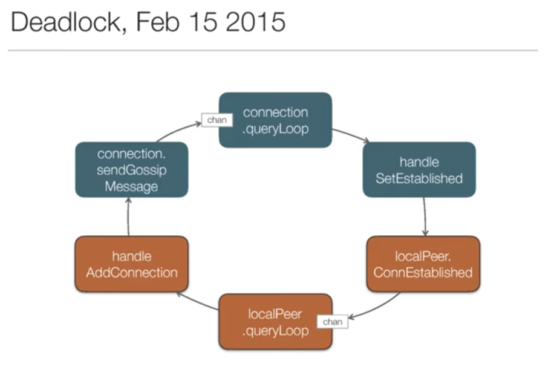

# genserver  [](https://goreportcard.com/report/github.com/dominicletz/genserver)

Minimal actor model component GenServer inspired by this awesome [talk by Bryan Boreham](https://www.youtube.com/watch?v=yCbon_9yGVs) who complained about not having a library. So here you go Bryan 😀.

* Keep concurrency in check with GenServers
* Have a minimal library to keep things similiar
* Builtin deadlock detection

## Basic Example:

```
type Counter struct {
	gen    *genserver.GenServer
	number int64
}

func StartCounter() *Counter {
	gen := genserver.New("Counter")
	return &Counter{gen: gen, number: 0}
}

func (counter *Counter) Incr() (ret uint64) {
	counter.gen.Call(func() {
		counter.number++
        ret = counter.number
	})
    return
}
```

## Deadlock detection

The library will detect when a GenServer is beeing waited for more than 30 seconds to detect Deadlocks. This can be disabled but helps in default mode to detect deadlocks such as those Bryan showed in his presentation:



Running the example in `examples/deadlock/deadlock.go` you will get a WARNING like this:

```
GenServer WARNING timeout in Connection:19
GenServer stuck in
goroutine 19 [runnable]:
runtime.Stack(0xc00036c000, 0xf4240, 0xf4240, 0xc00036c001, 0x1)
        /usr/lib/go-1.15/src/runtime/mprof.go:803 +0x12a
github.com/dominicletz/genserver.(*GenServer).Call(0xc0000c4140, 0xc000096240)
        /home/dominicletz/projects/genserver/genserver.go:111 +0x1e9
main.(*Peer).ConnEstablished(0xc000096220)
        /home/dominicletz/projects/genserver/examples/deadlock/deadlock.go:58 +0x5f
main.(*Connection).handleSetEstablished(0xc0000961f0)
        /home/dominicletz/projects/genserver/examples/deadlock/deadlock.go:45 +0x2f
main.(*Connection).queryLoop(0xc0000961f0)
        /home/dominicletz/projects/genserver/examples/deadlock/deadlock.go:41 +0x2b
main.(*Connection).SendGossipMessage.func1()
        /home/dominicletz/projects/genserver/examples/deadlock/deadlock.go:36 +0x2a
github.com/dominicletz/genserver.(*GenServer).Call.func1()
        /home/dominicletz/projects/genserver/genserver.go:105 +0x2f
github.com/dominicletz/genserver.(*GenServer).loop(0xc0000c4050)
        /home/dominicletz/projects/genserver/genserver.go:70 +0x5b
created by github.com/dominicletz/genserver.New
        /home/dominicletz/projects/genserver/genserver.go:52 +0xc5
```

## Building the examples

```
> go build -tags example  ./examples/*
```

## Note on runtime.GetGoID()

By default the GenServer module is using https://github.com/petermattis/goid to get the goid for two uses:
1) To make Self-calls safe, if the callers goid == the callee goid they can pass, preventing deadlocks by sending a message to one-self.
2) Deadlock detection, to print the stacktrace of the correct goroutine
If you don't have `runtime.GetGoID()` yet run the attached script: 

If you're running on an arm32 or other seldom architecture petermattis/goid will fallback to a very slow method of getting the goid. In that case you can use the included script to inject a fast native goid accessor into your runtime:  
```
> ./patch_runtime.sh
``` 

Then compile your app with the additional tag `patch_runtime`. E.g. to test if this works you can compile the examples with:

```
> go build -tags patch_runtime,example  ./examples/*
```


